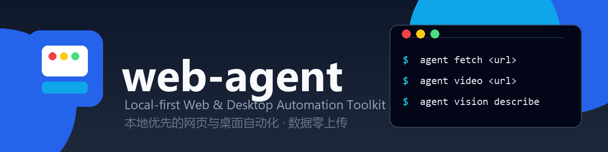
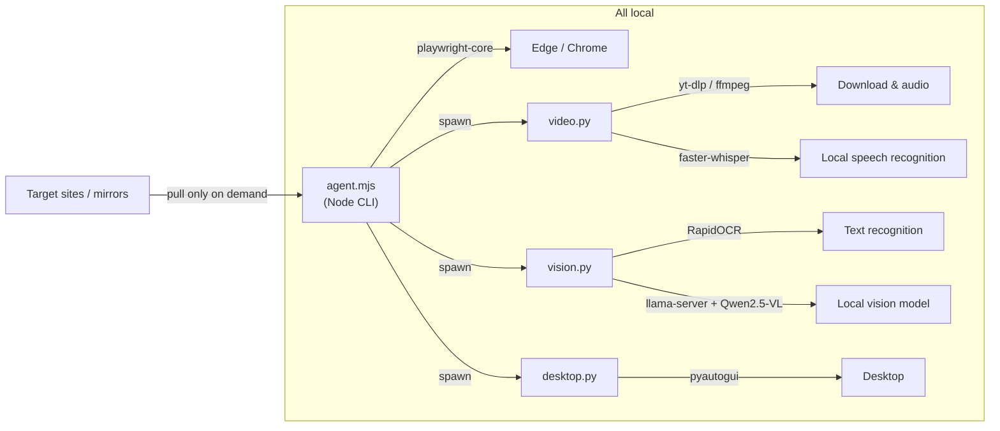

<p align="center">
  
</p>

<p align="center">
  <a href="README.md">中文</a> ·
  <a href="#quick-start">Quick Start</a> ·
  <a href="#features">Features</a> ·
  <a href="#examples">Examples</a> ·
  <a href="#security--compliance">Security</a> ·
  <a href="#roadmap">Roadmap</a>
</p>

<p align="center">
  
  
  
  
  
  
  
  
</p>

# web-agent

> **Give your AI eyes and hands.**
> Let any LLM browse the web, transcribe videos, understand screenshots, and control the desktop —
> all running locally with zero data upload.

**web-agent** is a local-first web & desktop automation toolkit: read web pages, capture screenshots,
automate forms, transcribe videos, understand images (OCR + a local vision-language model), and control
the desktop — all from one command-line tool.

> Use it standalone, or connect it to any AI assistant via **CLI / MCP / Agent Skill**
> (Claude, Cursor, DeepSeek Harness, and more).

## ✨ Features

| # | Feature | Command | Notes |
| --- | --- | --- | --- |
| 1 | Read web pages | `fetch <url>` | Title/body/tables/links → Markdown |
| 2 | Screenshot | `shot <url>` | Save page screenshots |
| 3 | Watch & capture frames | `open <url>` | Periodic frame capture while a page/video plays |
| 4 | Form automation | `act --json '...'` | goto/fill/click/type/extract step scripts |
| 5 | Video transcription | `video <url>` | Subtitles first, local Whisper fallback |
| 6 | Media stream capture | `media <url>` | Grab real m3u8/mp4/audio stream URLs |
| 7 | File download | `download <url>` | Any file |
| 8 | Image OCR | `vision ocr ` | Local RapidOCR, text in seconds |
| 9 | Image understanding | `vision describe ` | Local Qwen2.5-VL-3B vision-language model |
| 10 | Desktop control | `desktop ...` | Mouse/keyboard/screenshot with window-verification safety |
| 11 | Auto cleanup | `cleanup` | Remove intermediates, keep only extracted artifacts |
| 12 | MCP integration | `mcp/server.mjs` | All capabilities exposed as MCP tools for any MCP-compatible AI client |

## 🆚 Why web-agent

| Capability | web-agent | Playwright MCP | Hand-written scrapers |
| --- | --- | --- | --- |
| Read pages / screenshot / form automation | ✅ | ✅ | DIY |
| Video transcription (subtitles + local Whisper) | ✅ | ❌ | Hard |
| Local OCR for text in images | ✅ | ❌ | Hard |
| Local vision-language model that "sees" images | ✅ | ❌ | — |
| Desktop control (mouse & keyboard) | ✅ | ❌ | — |
| Zero data upload (local processing) | ✅ | Depends on setup | ✅ |
| Auto-cleanup of leftover files | ✅ | ❌ | — |
| Works with any AI assistant | ✅ CLI / MCP / Skill | ✅ MCP only | ❌ |

**The key difference**: web-agent is more than browser automation — it bundles video transcription,
local OCR, a local vision model, and desktop control into one privacy-first toolkit, so your AI never
needs a cloud vision API to understand web content.

## 🚀 Quick Start

### Requirements

- **Node.js** ≥ 20 · **Python** ≥ 3.10 · **Edge or Chrome**
- **ffmpeg** (optional, for video transcription)
- **NVIDIA GPU** (optional, accelerates the vision model; CPU fallback included)

### Windows one-click install

```bat
git clone https://github.com/Philosophy79/web-agent
cd web-agent
install.bat
```

First run downloads all dependencies, the vision model (~3.3 GB, via Chinese mirror), and the llama.cpp engine (auto-detects NVIDIA GPU vs CPU).

### Manual install

```bash
npm install --no-audit --no-fund
pip install yt-dlp faster-whisper pyautogui pyperclip rapidocr
python python/download_vlm.py
# llama.cpp engine (Windows + CUDA 12.4 example; see FAQ for other OS)
mkdir bin
curl -sL -o bin/llama_cuda12.zip "https://ghfast.top/https://github.com/ggml-org/llama.cpp/releases/download/b10819/cudart-llama-bin-win-cuda-12.4-x64.zip"
curl -sL -o bin/llama_main.zip "https://ghfast.top/https://github.com/ggml-org/llama.cpp/releases/download/b10819/llama-b10819-bin-win-cuda-12.4-x64.zip"
python -c "import zipfile; [zipfile.ZipFile('bin/'+n).extractall('bin') for n in ['llama_cuda12.zip','llama_main.zip']]"
```

### Verify

```bash
node agent.mjs fetch https://example.com
node agent.mjs help
```

## 📖 Examples

```bash
# Read a page into Markdown
node agent.mjs fetch "https://example.com" --format markdown

# Automate a search: fill → submit → extract results → screenshot
node agent.mjs act --json '{"steps":[
  {"action":"goto","url":"https://cn.bing.com/"},
  {"action":"fill","selector":"#sb_form_q","value":"computer network tutorial"},
  {"action":"press","selector":"#sb_form_q","key":"Enter"},
  {"action":"wait","ms":2000},
  {"action":"extract","selector":"#b_results","label":"results"},
  {"action":"shot","file":"output/result.png"}
]}'

# Transcribe a video (subtitles first, local Whisper fallback)
node agent.mjs video "https://www.bilibili.com/video/BVxxxx" --model small --lang zh
# → downloads/xxx/transcript.txt + transcript.srt (original media auto-deleted)

# Read text from an image
node agent.mjs vision ocr screenshot.png

# Ask a local vision model about an image
node agent.mjs vision describe screenshot.png --prompt "What is in this image?"

# Desktop control — always verify the target window first
node agent.mjs desktop foreground
node agent.mjs desktop focus "Notepad"
node agent.mjs desktop type "Hello from web-agent"
```

## 🤖 Connect to AI Assistants (three ways, works with any agent)

| Method | Best for | Notes |
| --- | --- | --- |
| **Direct CLI** | Any agent with terminal access (Claude Code, Cursor Agent, Codex, …) | Just let it run `node agent.mjs <command>` — zero config |
| **MCP** | Claude Desktop, Cursor, VS Code Copilot, DSH, Cherry Studio, Kimi, Doubao, … | Built-in MCP server (12 tools); add one line to the client config, see [docs/MCP.md](docs/MCP.md) |
| **Agent Skill** | DeepSeek Harness and other Agent-Skills environments | Load `skill/web-agent/SKILL.md` |

Quick MCP config (Claude Desktop / Cursor / VS Code `mcp.json`):

```json
{
  "mcpServers": {
    "web-agent": {
      "command": "node",
      "args": ["C:\\path\\to\\web-agent\\mcp\\server.mjs"]
    }
  }
}
```

Self-test: `node tests/mcp_test.mjs`

## 🏗️ Architecture



## 🧹 Auto Cleanup

After transcription the tool automatically deletes the video file, `audio.wav`, and all intermediates — **only `transcript.txt` and `transcript.srt` remain**. Temporary cookies and media-URL lists are deleted right after use. `node agent.mjs cleanup --dry-run` previews a global sweep. Files in your own directories are never touched.

## 🔒 Security & Compliance

- **Dangerous-action circuit breaker**: password/payment/transfer/delete/account-cancellation steps require explicit `--approve`
- **Passwords are never handled by the tool** — you type them yourself in the visible browser window
- **Desktop input safety**: confirm the foreground window, focus the exact target window, then type; move the mouse to the top-left screen corner for an emergency stop
- **Local-first privacy**: see [docs/PRIVACY.md](docs/PRIVACY.md) — zero upload
- **Legal use only**: see [docs/COMPLIANCE.md](docs/COMPLIANCE.md) — process only content you are authorized to access

## ❓ FAQ

| Question | Answer |
| --- | --- |
| Model download slow? | Built-in hf-mirror CDN; set `HF_ENDPOINT` to your own mirror if needed |
| Site risk-control (e.g. Douyin)? | Turn off overseas VPN/proxy and retry; `media` is the fallback channel |
| No NVIDIA GPU? | `install.bat` downloads the CPU engine automatically (slower vision, still works) |
| macOS / Linux? | Use the matching llama.cpp prebuilt binaries in `bin/`, all commands are identical |
| Vision service uses memory? | Stop it anytime with `node agent.mjs vision describe --stop` |
| Connect to my AI client? | Use the built-in MCP server — see [docs/MCP.md](docs/MCP.md); direct CLI and Skill are also available |

## 🗺️ Roadmap

- [x] v1.0.0 — 11 core capabilities
- [x] Windows one-click install + China-friendly mirrors
- [x] AI assistant skill adapter (`skill/web-agent/`)
- [x] v1.1.0 — MCP adapter (12 tools, works with any MCP-compatible AI client)
- [ ] More site adapters (YouTube subtitles, Xiaohongshu, WeChat Channels)
- [ ] Task orchestration via YAML workflow files
- [ ] Web control panel (click-to-select elements → generate `act` scripts)
- [ ] Swappable vision/speech models

## 🤝 Contributing

Pull requests are welcome — see [CONTRIBUTING.md](CONTRIBUTING.md) and [CODE_OF_CONDUCT.md](CODE_OF_CONDUCT.md).
Please report security vulnerabilities privately per [SECURITY.md](SECURITY.md).

## 📄 License

[MIT](LICENSE) © [Philosophy79](https://github.com/Philosophy79)

---

If this project helps you, a ⭐ Star means a lot!
