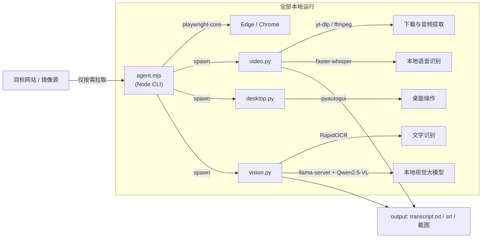

<p align="center">
  
</p>

<p align="center">
  <a href="README.en.md">English</a> ·
  <a href="#快速开始">快速开始</a> ·
  <a href="#功能一览">功能</a> ·
  <a href="#使用示例">示例</a> ·
  <a href="#安全与合规">安全与合规</a> ·
  <a href="#路线图">路线图</a>
</p>

<p align="center">
  
  
  
  
  
  
</p>

# web-agent

**本地优先的网页与桌面自动化工具包**——读网页、截图、表单自动化、视频转录、本地识图（OCR + 视觉大模型）、桌面控制，一套命令全部搞定。

> 所有数据都在你的电脑本地处理，**零上传**。可独立使用，也可通过 **CLI / MCP / Agent Skill** 三种方式接入任何 AI 助手（Claude、Cursor、DeepSeek Harness 等）。

## ✨ 功能一览

| # | 功能 | 命令 | 说明 |
| --- | --- | --- | --- |
| 1 | 读网页 | `fetch <url>` | 提取标题/正文/表格/链接，输出 Markdown 资料 |
| 2 | 截图 | `shot <url>` | 打开浏览器截图保存 |
| 3 | 观看抓帧 | `open <url>` | 页面/视频播放中周期性抓帧 |
| 4 | 表单自动化 | `act --json '...'` | goto/fill/click/type/extract 步骤脚本 |
| 5 | 视频转录 | `video <url>` | 字幕优先，无字幕走本地 Whisper 语音识别 |
| 6 | 媒体流拦截 | `media <url>` | 抓取页面真实流地址（含风控站点备用通道） |
| 7 | 文件下载 | `download <url>` | 任意文件下载 |
| 8 | 识图 OCR | `vision ocr ` | 本地 RapidOCR，秒级识别图中文字 |
| 9 | 图像理解 | `vision describe ` | 本地视觉大模型 Qwen2.5-VL-3B 看图回答 |
| 10 | 桌面控制 | `desktop ...` | 鼠标/键盘/截图（带前台窗口安全确认） |
| 11 | 残留清理 | `cleanup` | 用完即删，只留提取产物 |
| 12 | MCP 接入 | `mcp/server.mjs` | 全部能力注册为 MCP 工具，任何支持 MCP 的 AI 客户端即插即用 |

## 🚀 快速开始

### 环境要求

- **Node.js** ≥ 20
- **Python** ≥ 3.10
- **ffmpeg**（可选，视频转录需要）
- **Edge 或 Chrome** 浏览器
- **NVIDIA 显卡**（可选，视觉大模型 GPU 加速；无显卡自动退化为 CPU）

### Windows 一键安装

```bat
git clone https://github.com/Philosophy79/web-agent
cd web-agent
install.bat
```

首次安装会自动：装 Node/Python 依赖 → 下载视觉大模型（约 3.3GB，国内镜像）→ 下载 llama.cpp 推理引擎（自动识别有无 NVIDIA 显卡）。

### 手动安装

```bash
npm install --no-audit --no-fund
pip install yt-dlp faster-whisper pyautogui pyperclip rapidocr
python python/download_vlm.py          # 视觉大模型（hf-mirror 镜像）
# llama.cpp 推理引擎（Windows + CUDA 12.4 示例，其他系统见 FAQ）
mkdir bin
curl -sL -o bin/llama_cuda12.zip "https://ghfast.top/https://github.com/ggml-org/llama.cpp/releases/download/b10819/cudart-llama-bin-win-cuda-12.4-x64.zip"
curl -sL -o bin/llama_main.zip "https://ghfast.top/https://github.com/ggml-org/llama.cpp/releases/download/b10819/llama-b10819-bin-win-cuda-12.4-x64.zip"
python -c "import zipfile; [zipfile.ZipFile('bin/'+n).extractall('bin') for n in ['llama_cuda12.zip','llama_main.zip']]"
```

### 验证安装

```bash
node agent.mjs fetch https://example.com    # 应输出网页内容
node agent.mjs help                         # 查看全部命令
```

## 📖 使用示例

### 读网页 → 整理成资料

```bash
node agent.mjs fetch "https://example.com" --format markdown
```

```text
# Example Domain
> https://example.com/
## 标题结构
- (h1) Example Domain
## 正文段落
This domain is for use in documentation examples ...
## 链接（共 1 个，展示前 1 个）
- [Learn more](https://iana.org/domains/example)
```

### 表单自动化（自动填写 + 提取结果）

```bash
node agent.mjs act --json '{"steps":[
  {"action":"goto","url":"https://cn.bing.com/"},
  {"action":"fill","selector":"#sb_form_q","value":"计算机网络 入门教程"},
  {"action":"press","selector":"#sb_form_q","key":"Enter"},
  {"action":"wait","ms":2000},
  {"action":"extract","selector":"#b_results","label":"搜索结果"},
  {"action":"shot","file":"output/result.png"}
]}'
```

### 视频转录（口播 → 文字稿 + SRT 字幕）

```bash
# B站 / YouTube 等通用平台
node agent.mjs video "https://www.bilibili.com/video/BVxxxx" --model small --lang zh

# 抖音等有下载风控的站点：拦截媒体流 → 下载音频 → 本地识别
node agent.mjs media "https://www.douyin.com/video/xxxx" --seconds 25 --save-audio downloads/audio.mp4
python python/video.py --video-file downloads/audio.mp4 --model small --lang zh
```

转录产物（原始视频/音频已自动删除）：

```text
[    0.5s -     3.0s] 作为一个大学计算机专业一年
[    3.0s -     5.7s] 建完了肆意语言数据结构与算法
...
文字稿: downloads/xxx/transcript.txt
字幕文件: downloads/xxx/transcript.srt
```

### 识图（OCR / 视觉大模型）

```bash
node agent.mjs vision ocr output/result.png
# [y= 135] Example Domain
# [y= 177] This domain is for use in documentation examples ...

node agent.mjs vision describe output/result.png --prompt "一句话描述这张图"
# 这是一个示例域名的警告信息，提示用户避免在操作中使用该域。

node agent.mjs vision describe --stop    # 关闭常驻视觉服务
```

### 桌面控制（输入前先确认目标窗口）

```bash
node agent.mjs desktop foreground        # 查看当前前台窗口
node agent.mjs desktop focus "记事本"     # 精确激活目标窗口
node agent.mjs desktop type "要输入的文字"
node agent.mjs desktop shot screen.png
```

## 🤖 接入 AI 助手（三种方式，兼容所有主流 agent）

| 方式 | 适用场景 | 说明 |
| --- | --- | --- |
| **CLI 直调** | 任何带终端能力的 agent（Claude Code、Cursor Agent、Codex 等） | 让 agent 执行 `node agent.mjs <命令>`，零配置 |
| **MCP** | Claude Desktop、Cursor、VS Code Copilot、DSH、Cherry Studio、Kimi、豆包等 | 内置 MCP Server（12 个工具），客户端配置加一行即插即用，见 [docs/MCP.md](docs/MCP.md) |
| **Agent Skill** | DeepSeek Harness、支持 Agent Skills 约定的环境 | 加载 `skill/web-agent/SKILL.md`，AI 自动获得调用说明 |

MCP 快速配置示例（Claude Desktop / Cursor / VS Code 的 `mcp.json` 通用格式）：

```json
{
  "mcpServers": {
    "web-agent": {
      "command": "node",
      "args": ["C:\\path\\to\\web-agent\\mcp\\server.mjs"]
    }
  }
}
```

自测：`node tests/mcp_test.mjs`

## 🏗️ 架构



## 🧹 自动清理（用完即删）

- 视频转录完成自动删除：视频文件、`audio.wav`、`.part/.ytdl/.vtt` 等中间产物，**只保留 `transcript.txt` + `transcript.srt`**
- 临时 Cookie、媒体地址清单用完自动删除
- `node agent.mjs cleanup [--dry-run]` 手动全局清扫；`--keep-video` 等开关可保留指定产物
- 绝不触碰用户自己目录里的文件

## 🔒 安全与合规

- **危险动作熔断**：密码/支付/转账/删除/注销等操作必须显式 `--approve`
- **密码铁律**：密码由用户本人在可见窗口亲自输入，工具不接触、不保存
- **桌面输入安全**：先 `foreground` 确认、再 `focus` 激活目标窗口后才输入；鼠标甩到屏幕左上角紧急停止
- **本地优先**：见 [docs/PRIVACY.md](docs/PRIVACY.md) —— 网页/转录/识图全本地，零上传
- **合法使用**：见 [docs/COMPLIANCE.md](docs/COMPLIANCE.md) —— 仅限处理自己有权访问的公开或自有内容

## ❓ 常见问题

| 问题 | 解决 |
| --- | --- |
| 下载模型慢/失败 | 脚本内置 hf-mirror 国内镜像；也可手动设置 `HF_ENDPOINT` |
| 抖音等站点风控 | 关闭海外代理/加速器后重试；用 `media` 备用通道 |
| 没有 NVIDIA 显卡 | `install.bat` 自动下载 CPU 版引擎；视觉描述较慢但可用 |
| pip 安装慢 | `pip install -i https://pypi.tuna.tsinghua.edu.cn/simple <包>` |
| macOS / Linux | llama.cpp 官方提供对应预编译包，替换 `bin/` 下的二进制即可，用法相同 |
| 视觉服务占用内存 | `node agent.mjs vision describe --stop` 随时关闭 |
| 怎么接入我的 AI 客户端 | 用内置 MCP Server，见 [docs/MCP.md](docs/MCP.md)；支持 CLI 直调与 Skill 两种备选 |

## 🗺️ 路线图

- [x] v1.0.0 核心 11 项能力（网页 / 视频 / 识图 / 桌面 / 清理）
- [x] Windows 一键安装 + 国内镜像加速
- [x] AI 助手 skill 适配层（`skill/web-agent/`）
- [x] v1.1.0 MCP 适配层（12 个工具，兼容所有主流 AI 客户端）
- [ ] 更多站点适配器（YouTube 字幕、小红书、视频号）
- [ ] 任务编排：YAML 定义多步骤自动化流程
- [ ] Web 控制面板（浏览器里点选元素生成 act 脚本）
- [ ] 多模型支持（视觉/语音模型可切换）

欢迎在 [Issues](https://github.com/Philosophy79/web-agent/issues) 提出需求或认领开发。

## 🤝 贡献

欢迎 PR！请先阅读 [CONTRIBUTING.md](CONTRIBUTING.md) 与 [CODE_OF_CONDUCT.md](CODE_OF_CONDUCT.md)。
安全漏洞请按 [SECURITY.md](SECURITY.md) 的流程私下报告。

## 📄 许可证

[MIT](LICENSE) © [Philosophy79](https://github.com/Philosophy79)

---

如果这个项目对你有用，欢迎点个 ⭐ Star，让更多人看到！
